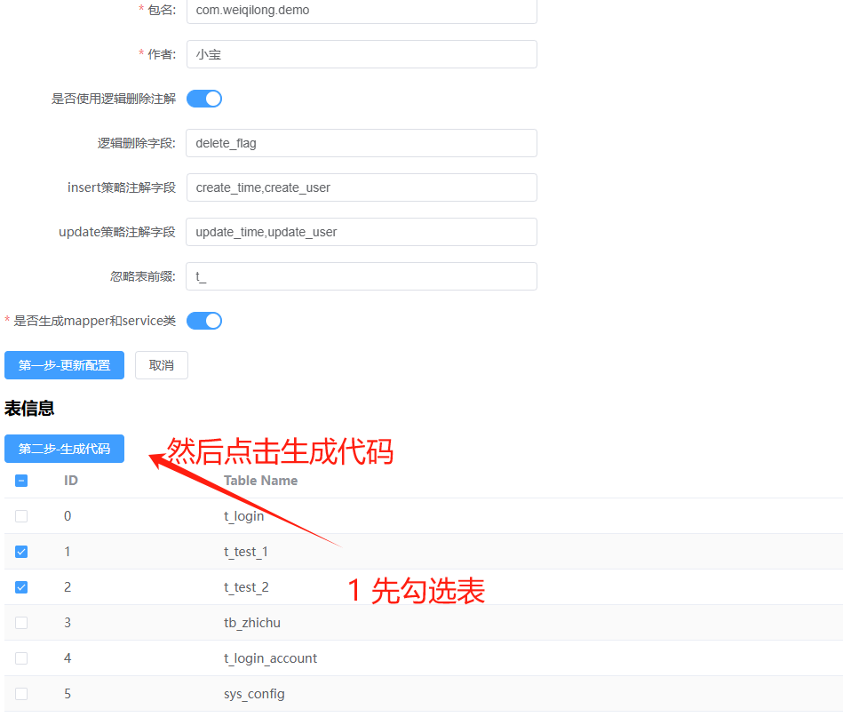

# springboot3.3.3 + java21 + maven

这个是springboot项目，java版本是21，springboot版本3.3.3
直接运行就可以了
先用maven打包（打包命令网上都有 mvn clean install ）
然后java -jar方式运行
java -jar xxx.jar
或者用idea运行代码

# 运行

```
mvn clean install
java -jar xxx.jar
```

# 介绍

```
这个是mysql逆向生成java实体类的后端代码
业务项目要求：
1 springboot
2 mybatisplus
3 mysql
4 lombok

以前看网上的逆向代码，虽然挺好，但是不符合我的要求，所以写了一个符合我开发习惯的。
代码不是很难，大家可以按照自己的喜好进行修改

```

## 预览

### 1 填写配置信息，并保存。此保存是临时保存。每次保存都会覆盖之前的配置。后端服务重启后，数据丢失。


### 2 点击更新配置后，会查询出所有的表，选中要逆向的表，点击生成代码即可。



### 3 提示成功，就可以去“生成目录”复制 java 类啦

成功提示


实体类


mapper 接口


service 接口


serviceImpl 类

